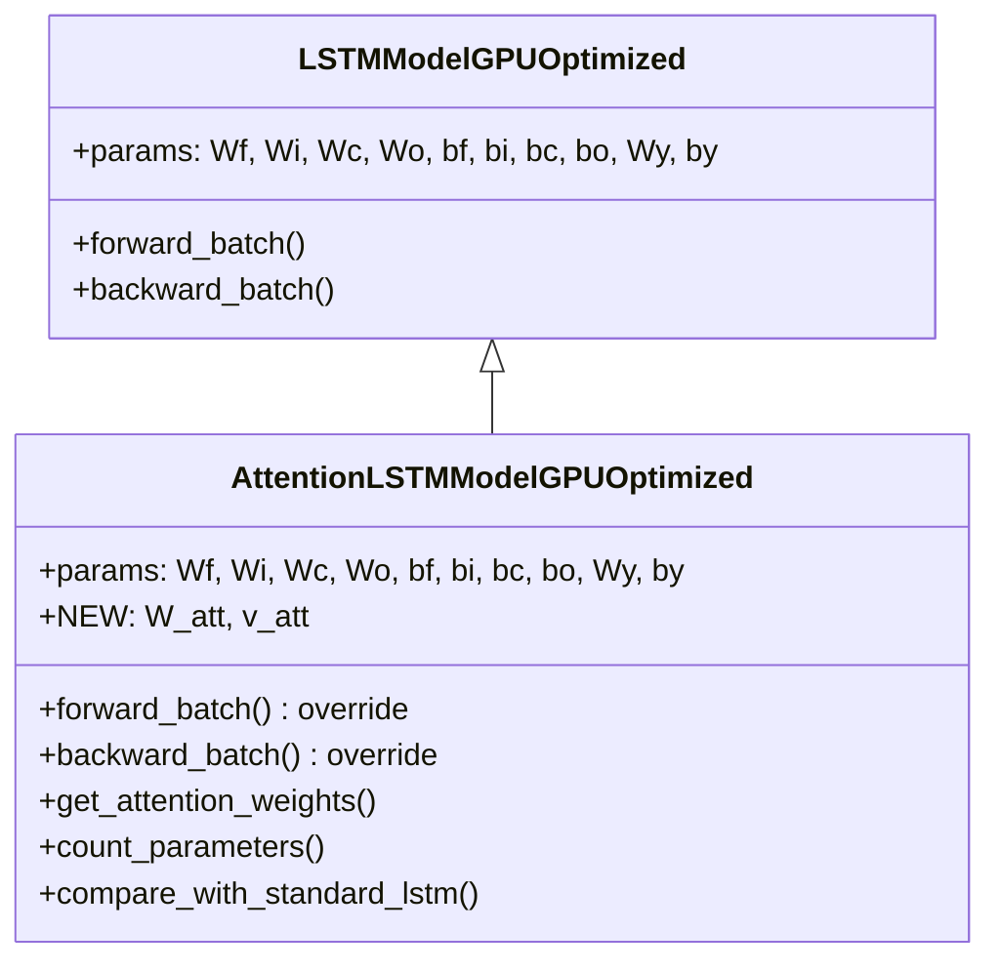

# AttentionLSTMModelGPUOptimized

Manual untuk variasi Attention LSTM dengan GPU optimization.

---

## Overview

Attention LSTM menambahkan mekanisme attention di atas LSTM standar. Alih-alih hanya menggunakan hidden state terakhir $h_T$ untuk prediksi, model menghitung weighted sum (context vector) dari semua hidden states $h_1, h_2, ..., h_T$.

$$c = \sum_{t=1}^{T} \alpha_t \cdot h_t$$

> [!TIP]
> Attention memungkinkan model untuk fokus pada timestep yang paling relevan untuk prediksi, memberikan interpretabilitas tambahan.

---

## Class Hierarchy



---

## Parameter Addition

| Model | Weight Matrices | Bias Vectors | Additional |
|-------|-----------------|--------------|------------|
| Standard LSTM | Wf, Wi, Wc, Wo, Wy | bf, bi, bc, bo, by | - |
| **Attention LSTM** | Wf, Wi, Wc, Wo, Wy | bf, bi, bc, bo, by | **W_att (H×H), v_att (H×1)** |

> [!IMPORTANT]
> Parameter tambahan `W_att` dan `v_att` diinisialisasi dengan Xavier/Glorot scaling.

---

## Mathematical Formulation

### Attention Mechanism

```
1. Collect all hidden states:
   H = [h_1, h_2, ..., h_T]           ← (seq_len, hidden_size, batch_size)

2. Compute attention scores:
   S_t = tanh(W_att · h_t)            ← Pre-attention transformation
   e_t = v_att^T · S_t                ← Scalar score for each timestep

3. Normalize with softmax:
   α_t = softmax(e)_t = exp(e_t) / Σ exp(e_j)

4. Compute context vector:
   c = Σ α_t · h_t                    ← Weighted sum of hidden states

5. Output prediction:
   ŷ = σ(Wy · c + by)                 ← Use context instead of h_T
```

---

## Forward Pass

```python
# Standard LSTM forward (collect all hidden states)
all_h = []
for t in range(seq_len):
    # ... standard LSTM gates computation ...
    all_h.append(h_new)

# Stack hidden states: (seq_len, hidden_size, batch_size)
H = stack(all_h)

# Attention scoring
S = tanh(W_att @ H)              # Transform each h_t
e = v_att.T @ S                  # Scalar scores: (seq_len, batch_size)

# Softmax normalization
alpha = softmax(e, axis=0)       # Attention weights: (seq_len, batch_size)

# Context vector
context = sum(alpha * H, axis=0) # (hidden_size, batch_size)

# Output layer (using context instead of h_final)
y_pred = sigmoid(Wy @ context + by)
```

---

## Backward Pass

Gradient mengalir melalui attention mechanism ke semua hidden states:

```python
# 1. Output layer gradients
d_context = Wy.T @ dy

# 2. Context vector gradients
# c = Σ α_t · h_t
d_alpha = sum(d_context * H, axis=hidden)    # (seq_len, batch_size)
d_H_att = alpha * d_context                   # (seq_len, hidden, batch)

# 3. Softmax backward
# α = softmax(e)
# d_e_i = α_i * (d_alpha_i - Σ_j α_j * d_alpha_j)
sum_term = sum(alpha * d_alpha, axis=0)
d_e = alpha * (d_alpha - sum_term)

# 4. Attention score backward
# e_t = v_att^T @ S_t
d_v_att = sum(S * d_e)           # Gradient for v_att
d_S = v_att @ d_e                # (seq_len, hidden, batch)

# 5. Tanh backward
# S = tanh(W_att @ H)
d_pre_S = d_S * (1 - S^2)
d_W_att = sum_t(d_pre_S[t] @ H[t].T)  # Gradient for W_att
d_H_Watt = W_att.T @ d_pre_S          # Additional gradient to H

# 6. Total gradient to hidden states
d_H_total = d_H_att + d_H_Watt

# 7. LSTM BPTT (with attention gradients)
for t in reversed(range(seq_len)):
    dh = dh_next + d_H_total[t]   # Add attention gradient
    # ... standard LSTM backward ...
```

> [!NOTE]
> Setiap hidden state menerima gradien dari attention mechanism, memungkinkan model untuk belajar representasi yang lebih baik di setiap timestep.

---

## Usage Example

```python
from src.model.lstm_attention_optimized import AttentionLSTMModelGPUOptimized

# Initialize model
model = AttentionLSTMModelGPUOptimized(
    input_size=10,
    hidden_size=64,
    output_size=1,
    cw=2.2
)

# Check parameter count
comparison = model.compare_with_standard_lstm()
print(f"Standard: {comparison['standard_lstm_params']} params")
print(f"Attention: {comparison['attention_lstm_params']} params")
print(f"Increase: {comparison['increase_percentage']:.2f}%")

# Train (inherits from parent)
history = model.train(
    X_train, y_train,
    X_val=X_val, y_val=y_val,
    epochs=100,
    batch_size=64,
    lr=0.001
)

# Predict
predictions = model.predict(X_test)

# Visualize attention weights
alpha = model.get_attention_weights(X_test[:5])
# alpha shape: (5, seq_len) - attention weights per sample
```

---

## Attention Visualization

```python
import matplotlib.pyplot as plt

# Get attention weights for a sample
alpha = model.get_attention_weights(X_test[:1])  # (1, seq_len)

plt.figure(figsize=(12, 3))
plt.bar(range(len(alpha[0])), alpha[0])
plt.xlabel('Timestep')
plt.ylabel('Attention Weight (α)')
plt.title('Attention Distribution Over Sequence')
plt.show()
```

> [!TIP]
> Attention weights menunjukkan timestep mana yang paling berpengaruh terhadap prediksi. Berguna untuk interpretabilitas model.

---

## When to Use Attention LSTM

**Use when:**
- Interpretabilitas penting (ingin tahu timestep mana yang relevan)
- Sequence panjang dengan informasi penting tersebar di berbagai posisi
- Model perlu fokus pada event spesifik dalam sequence
- Prediksi bergantung pada multiple timesteps, bukan hanya final state

**Trade-offs:**
- Parameter tambahan $(H^2 + H)$ untuk attention layer
- Sedikit lebih lambat karena attention computation
- Memory lebih besar untuk menyimpan semua hidden states
- Lebih powerful untuk capturing long-range dependencies

---

## Computational Complexity

| Operation | Complexity |
|-----------|------------|
| W_att @ H | $O(T \cdot H^2)$ |
| v_att^T @ S | $O(T \cdot H)$ |
| Softmax | $O(T)$ |
| Context sum | $O(T \cdot H)$ |

Total additional: $O(T \cdot H^2)$ per forward pass

---

## File Location

```
src/model/lstm_attention_optimized.py
```

## Related Models

- [LSTMModelGPUOptimized](./lstm_cupy_optimized.md) - Parent class (Standard LSTM)
- [BiLSTMModelGPUOptimized](./lstm_bidirectional.md) - Bidirectional LSTM
- [LayerNormLSTMModelGPUOptimized](./lstm_layernorm.md) - LSTM with Layer Normalization

## Reference

Bahdanau et al., "Neural Machine Translation by Jointly Learning to Align and Translate" (2015) - ICLR
