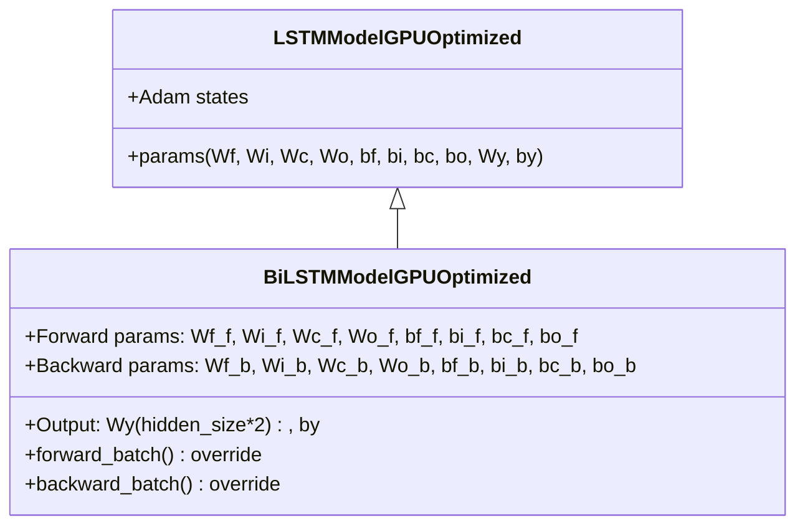

# BiLSTMModelGPUOptimized

Manual untuk variasi Bi-directional LSTM dengan GPU optimization dan Adam optimizer.

---

## Overview

Bi-directional LSTM memproses sequence dari dua arah:
- **Forward**: t=0 → T-1
- **Backward**: t=T-1 → 0

Ini memungkinkan model untuk menangkap konteks dari masa lalu dan masa depan pada setiap timestep.

---

## Class Hierarchy



---

## Architecture

```
Input Sequence: [x_0, x_1, x_2, ..., x_T-1]

Forward LSTM:  h_f_0 → h_f_1 → h_f_2 → ... → h_f_T-1 ──┐
                                                        ├─→ [h_f; h_b] → Wy → y_pred
Backward LSTM: h_b_0 ← h_b_1 ← h_b_2 ← ... ← h_b_T-1 ──┘
```

> [!IMPORTANT]
> Output layer `Wy` memiliki shape `(output_size, hidden_size * 2)` karena menerima concatenation dari kedua hidden states.

---

## Parameters

### Forward LSTM (suffix `_f`)
| Parameter | Shape | Description |
|-----------|-------|-------------|
| `Wf_f, Wi_f, Wc_f, Wo_f` | (hidden_size, hidden_size + input_size) | Gate weights |
| `bf_f, bi_f, bc_f, bo_f` | (hidden_size, 1) | Gate biases |

### Backward LSTM (suffix `_b`)
| Parameter | Shape | Description |
|-----------|-------|-------------|
| `Wf_b, Wi_b, Wc_b, Wo_b` | (hidden_size, hidden_size + input_size) | Gate weights |
| `bf_b, bi_b, bc_b, bo_b` | (hidden_size, 1) | Gate biases |

### Output Layer
| Parameter | Shape | Description |
|-----------|-------|-------------|
| `Wy` | (output_size, hidden_size * 2) | Output weights |
| `by` | (output_size, 1) | Output bias |

---

## Forward Pass

```python
# Forward direction: t = 0 to T-1
for t in range(seq_len):
    h_f, c_f = lstm_cell_forward(x_t, h_f, c_f, direction='f')

# Backward direction: t = T-1 to 0
for t in range(seq_len - 1, -1, -1):
    h_b, c_b = lstm_cell_forward(x_t, h_b, c_b, direction='b')

# Concatenate and output
h_combined = concat(h_f[-1], h_b[0])  # (hidden_size * 2, batch_size)
y_pred = sigmoid(Wy @ h_combined + by)
```

---

## Backward Pass

Gradien di-split menjadi dua bagian:

```python
dh_combined = Wy.T @ dy  # (hidden_size * 2, batch_size)
dh_f_next = dh_combined[:hidden_size]
dh_b_next = dh_combined[hidden_size:]
```

Kemudian BPTT dilakukan terpisah untuk:
1. Forward LSTM: dari t=T-1 ke t=0
2. Backward LSTM: dari t=0 ke t=T-1

---

## Usage Example

```python
from src.model import BiLSTMModelGPUOptimized

# Initialize model
model = BiLSTMModelGPUOptimized(
    input_size=10,      # Number of features
    hidden_size=32,     # Hidden units per direction (total 64)
    output_size=1,      # Binary classification
    cw=2.2              # Class weight
)

# Train (inherits from parent)
history = model.train(
    X_train, y_train,
    X_val=X_val, y_val=y_val,
    epochs=100,
    batch_size=64,
    lr=0.001
)

# Predict
predictions = model.predict(X_test)
```

---

## When to Use BiLSTM

**Use when:**
- Data sequence memiliki konteks penting di kedua arah
- Task seperti sequence labeling, NER, sentiment analysis
- Akses ke seluruh sequence tersedia saat inference

**Trade-offs:**
- 2x jumlah parameter dibanding unidirectional
- Tidak cocok untuk real-time/streaming prediction
- Lebih lambat untuk training

---

## File Location

```
src/model/lstm_bidirectional.py
```

## Related Models

- [LSTMModelGPUOptimized](./lstm_cupy_optimized.md) - Parent class (Standard LSTM)
- [PeepholeLSTMModelGPUOptimized](./lstm_peephole.md) - LSTM with peephole connections
