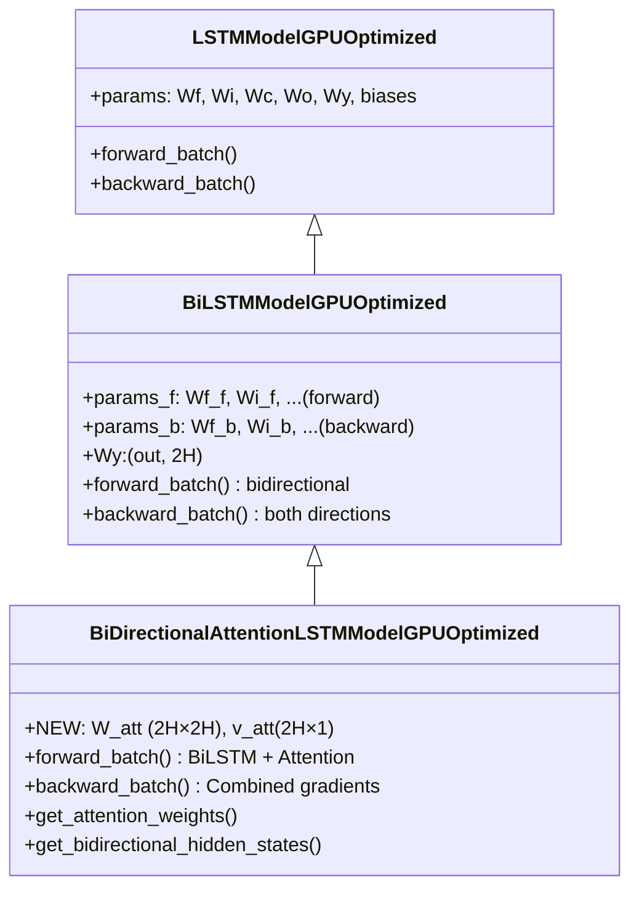
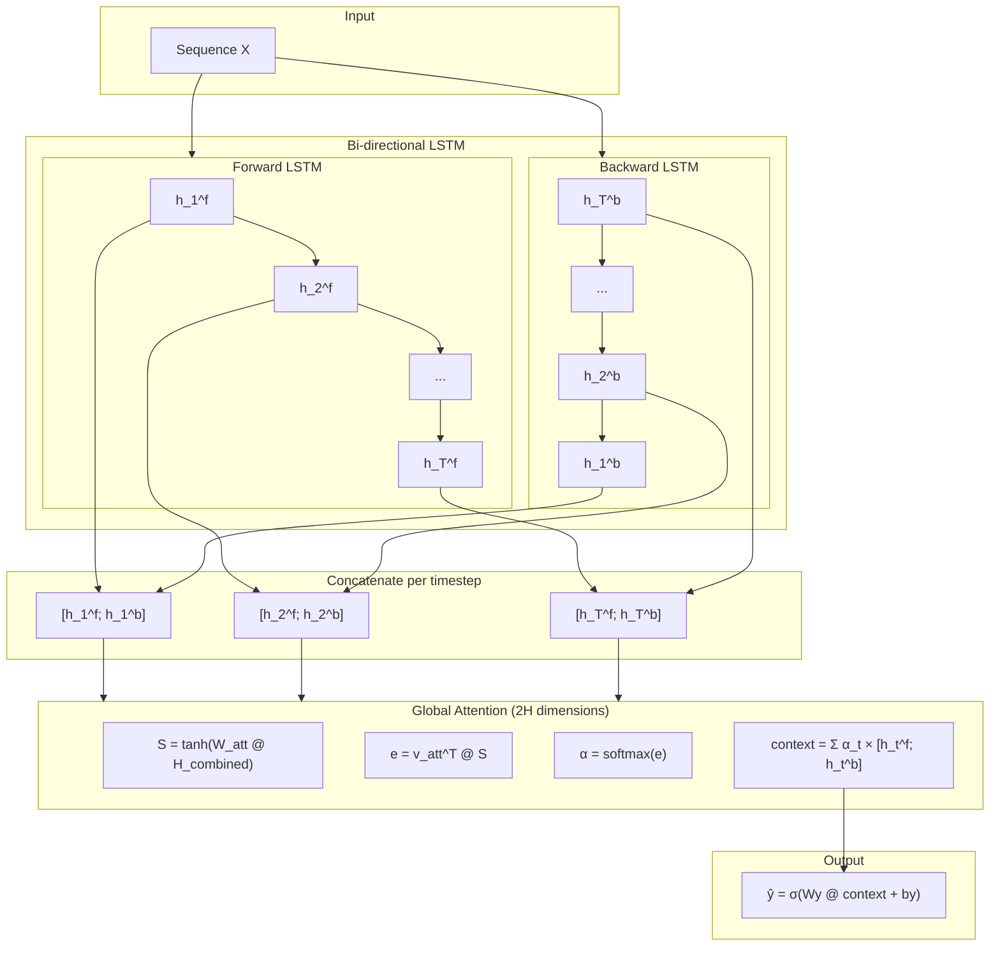

# BiDirectionalAttentionLSTMModelGPUOptimized

Manual untuk kombinasi Bi-Directional LSTM + Global Attention dengan GPU optimization.

---

## Overview

Model ini menggabungkan BiLSTM dengan Attention mechanism:

1. **BiLSTM**: Memproses sequence dari dua arah (forward & backward)
2. **Attention**: Beroperasi pada concatenated hidden states $[h_t^f; h_t^b]$

Keunggulan utama:
- **Dual Context**: Setiap timestep memiliki konteks dari masa lalu DAN masa depan
- **Attention Size**: $W_{att}$ berukuran $(2H \times 2H)$ untuk menangani gabungan hidden states

> [!TIP]
> Model ini ideal untuk menentukan timestep mana yang paling krusial, dengan mempertimbangkan informasi dari seluruh sequence.

---

## Class Hierarchy



---

## Parameter Comparison

| Model | LSTM Params | Attention Params | Total |
|-------|-------------|------------------|-------|
| Standard LSTM | $4H(H+I) + H \cdot out$ | - | baseline |
| BiLSTM | $2 \times 4H(H+I) + 2H \cdot out$ | - | ~2× LSTM |
| **BiLSTM + Attention** | $2 \times 4H(H+I) + 2H \cdot out$ | $(2H)^2 + 2H$ | ~2× + $4H^2$ |

> [!IMPORTANT]
> Attention parameters untuk BiLSTM 4× lebih besar dari unidirectional karena input adalah $(2H)$ bukan $(H)$.

---

## Architecture Diagram



---

## Mathematical Formulation

### BiLSTM (per direction)

```
Forward (d=f):  t = 0 → T-1
Backward (d=b): t = T-1 → 0

For each direction:
    f_t^d = σ(Wf_d·[h_{prev}^d, x_t] + bf_d)
    i_t^d = σ(Wi_d·[h_{prev}^d, x_t] + bi_d)
    c̃_t^d = tanh(Wc_d·[h_{prev}^d, x_t] + bc_d)
    c_t^d = f_t^d ⊙ c_{prev}^d + i_t^d ⊙ c̃_t^d
    o_t^d = σ(Wo_d·[h_{prev}^d, x_t] + bo_d)
    h_t^d = o_t^d ⊙ tanh(c_t^d)
```

### Attention on Concatenated States

```
1. Concatenate at each timestep:
   h_combined_t = [h_t^f; h_t^b]           ← (2H, batch)

2. Stack all timesteps:
   H_combined = [h_combined_1, ..., h_combined_T]  ← (T, 2H, batch)

3. Attention scoring (2H dimensions):
   S_t = tanh(W_att · h_combined_t)        ← W_att: (2H, 2H)
   e_t = v_att^T · S_t                     ← v_att: (2H, 1)

4. Softmax normalization:
   α_t = softmax(e)_t

5. Context vector:
   context = Σ α_t · h_combined_t          ← (2H, batch)

6. Output:
   ŷ = σ(Wy · context + by)                ← Wy: (out, 2H)
```

---

## Forward Pass

```python
# ===== BiLSTM Forward =====
all_h_forward = []
all_h_backward = []

# Forward direction: t = 0 to T-1
for t in range(seq_len):
    h_f, c_f = lstm_cell(x_t, h_f, c_f, params='f')
    all_h_forward.append(h_f)

# Backward direction: t = T-1 to 0
for t in reversed(range(seq_len)):
    h_b, c_b = lstm_cell(x_t, h_b, c_b, params='b')
    all_h_backward.append(h_b)

all_h_backward = reversed(all_h_backward)  # Align with forward

# ===== Concatenate Hidden States =====
H_combined = concatenate([H_forward, H_backward], axis=hidden)
# H_combined: (seq_len, 2H, batch)

# ===== Attention (2H dimensions) =====
S = tanh(W_att @ H_combined)         # (seq_len, 2H, batch)
e = v_att.T @ S                       # (seq_len, batch)
alpha = softmax(e, axis=time)         # Attention weights
context = sum(alpha * H_combined)     # (2H, batch)

# ===== Output =====
y_pred = sigmoid(Wy @ context + by)
```

---

## Backward Pass

```python
# ===== 1. Attention Gradients =====
d_context = Wy.T @ dy                 # (2H, batch)

# Context -> alpha, H_combined
d_alpha = sum(d_context * H_combined)
d_H_combined_att = alpha * d_context

# Softmax backward
d_e = alpha * (d_alpha - sum(alpha * d_alpha))

# Attention params (2H dimensions)
d_v_att = sum(S * d_e)               # (2H, 1)
d_S = v_att @ d_e                    # (seq_len, 2H, batch)
d_pre_S = d_S * (1 - S^2)
d_W_att = sum(d_pre_S @ H_combined.T)  # (2H, 2H)
d_H_combined_Watt = W_att.T @ d_pre_S

# Total gradient to H_combined
d_H_combined = d_H_combined_att + d_H_combined_Watt

# ===== 2. Split to Forward and Backward =====
d_H_forward = d_H_combined[:, :H, :]    # First H dimensions
d_H_backward = d_H_combined[:, H:, :]   # Last H dimensions

# ===== 3. Forward LSTM BPTT =====
for t in reversed(range(seq_len)):
    dh = dh_f_next + d_H_forward[t]     # Add attention gradient!
    # ... standard LSTM backward for forward direction ...

# ===== 4. Backward LSTM BPTT =====
for t in range(seq_len):
    dh = dh_b_next + d_H_backward[t]    # Add attention gradient!
    # ... standard LSTM backward for backward direction ...
```

> [!NOTE]
> Gradien dari attention didistribusikan ke KEDUA arah LSTM, memungkinkan model belajar representasi yang optimal dari kedua perspektif.

---

## Usage Example

```python
from src.model.lstm_bidirectional_attention import BiDirectionalAttentionLSTMModelGPUOptimized

# Initialize model
model = BiDirectionalAttentionLSTMModelGPUOptimized(
    input_size=10,
    hidden_size=64,    # Per direction (total 128 for attention)
    output_size=1,
    cw=2.2
)

# Check parameter count
comparison = model.compare_with_variants()
print(f"Standard LSTM: {comparison['standard_lstm_params']} params")
print(f"BiLSTM only: {comparison['bilstm_only_params']} params")
print(f"BiLSTM+Attention: {comparison['bilstm_attention_params']} params")
print(f"Attention overhead: {comparison['attention_overhead']} params")

# Train
history = model.train(
    X_train, y_train,
    X_val=X_val, y_val=y_val,
    epochs=100,
    batch_size=64,
    lr=0.001
)

# Predict
predictions = model.predict(X_test)

# Get attention weights for interpretability
alpha = model.get_attention_weights(X_test[:5])
# alpha shape: (5, seq_len) - importance of each timestep

# Get bidirectional hidden states
H_f, H_b = model.get_bidirectional_hidden_states(X_test[:5])
# H_f, H_b shape: (5, seq_len, hidden_size)
```

---

## Attention Visualization: Past vs Future Context

```python
import matplotlib.pyplot as plt
import numpy as np

# Get attention weights
alpha = model.get_attention_weights(X_test[:1])[0]  # (seq_len,)

# Get hidden states from both directions
H_f, H_b = model.get_bidirectional_hidden_states(X_test[:1])
H_f = H_f[0]  # (seq_len, H)
H_b = H_b[0]  # (seq_len, H)

# Compute "forward contribution" and "backward contribution"
# (simplified: L2 norm of hidden states)
forward_energy = np.linalg.norm(H_f, axis=1)
backward_energy = np.linalg.norm(H_b, axis=1)

fig, axes = plt.subplots(3, 1, figsize=(14, 8))

# Attention weights
axes[0].bar(range(len(alpha)), alpha, color='purple')
axes[0].set_ylabel('Attention α')
axes[0].set_title('Attention Weight (from both directions)')

# Forward hidden state energy
axes[1].plot(forward_energy, 'b-', label='Forward h_t^f')
axes[1].set_ylabel('Forward |h_t|')
axes[1].legend()

# Backward hidden state energy
axes[2].plot(backward_energy, 'r-', label='Backward h_t^b')
axes[2].set_ylabel('Backward |h_t|')
axes[2].set_xlabel('Timestep')
axes[2].legend()

plt.tight_layout()
plt.show()
```

> [!TIP]
> Membandingkan forward vs backward contributions dapat mengungkapkan apakah model lebih fokus pada konteks masa lalu atau masa depan untuk prediksi tertentu.

---

## When to Use BiLSTM + Attention

**Use when:**
- Konteks dari masa lalu DAN masa depan sama-sama penting
- Perlu interpretabilitas: timestep mana yang paling relevan
- Sequence cukup panjang untuk memanfaatkan attention
- Computational resources memadai (model ini paling besar)

**Trade-offs:**
- Parameter paling banyak di antara semua variant
- Training time lebih lama
- Memory footprint tinggi (menyimpan semua hidden states dari kedua arah)
- Tidak suitable untuk real-time streaming (butuh seluruh sequence)

---

## Computational Complexity

| Component | Parameters | Computation per timestep |
|-----------|------------|--------------------------|
| Forward LSTM | $4H(H+I)$ | $O(H^2)$ |
| Backward LSTM | $4H(H+I)$ | $O(H^2)$ |
| Attention (W_att) | $(2H)^2$ | $O(T \cdot 4H^2)$ |
| Attention (v_att) | $2H$ | $O(T \cdot 2H)$ |
| Output (Wy) | $2H$ | $O(2H)$ |

Total: $\approx 8H^2 + 8HI + 4H^2 + 2H \approx 12H^2$ parameters

---

## File Location

```
src/model/lstm_bidirectional_attention.py
```

## Related Models

- [LSTMModelGPUOptimized](./lstm_cupy_optimized.md) - Base class
- [BiLSTMModelGPUOptimized](./lstm_bidirectional.md) - Parent class (BiLSTM-only)
- [AttentionLSTMModelGPUOptimized](./lstm_attention.md) - Unidirectional + Attention
- [CIFGAttentionLSTMModelGPUOptimized](./lstm_cifg_attention.md) - Efficient CIFG + Attention

## References

- Schuster & Paliwal, "Bidirectional Recurrent Neural Networks" (1997) - IEEE TSP
- Bahdanau et al., "Neural Machine Translation by Jointly Learning to Align and Translate" (2015) - ICLR
