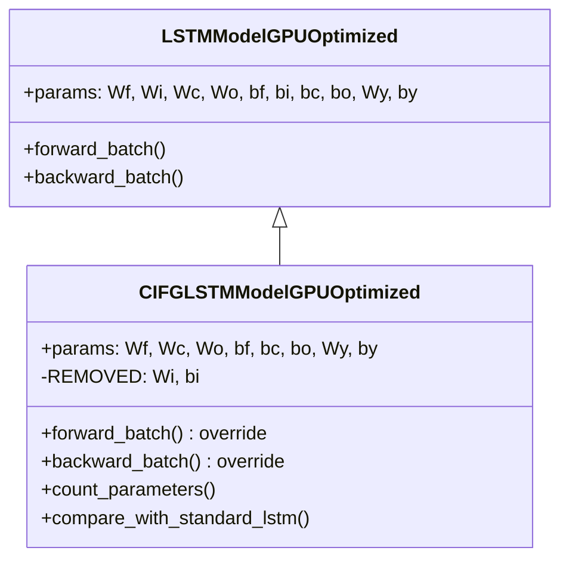

# CIFGLSTMModelGPUOptimized

Manual untuk variasi Coupled Input and Forget Gate (CIFG) LSTM dengan GPU optimization.

---

## Overview

CIFG LSTM menggabungkan input gate dan forget gate menjadi satu dengan hubungan:

$$i_t = 1 - f_t$$

Ini mengurangi parameter ~25% sambil mempertahankan performa kompetitif.

> [!TIP]
> CIFG menghasilkan constraint bahwa total kontribusi informasi lama dan baru selalu = 1.

---

## Class Hierarchy



---

## Parameter Reduction

| Model | Weight Matrices | Bias Vectors | Reduction |
|-------|-----------------|--------------|-----------|
| Standard LSTM | Wf, Wi, Wc, Wo, Wy | bf, bi, bc, bo, by | - |
| **CIFG LSTM** | Wf, Wc, Wo, Wy | bf, bc, bo, by | **~25%** |

> [!IMPORTANT]
> Parameter `Wi` dan `bi` dihapus karena input gate dihitung dari forget gate.

---

## Mathematical Formulation

### Standard LSTM
```
f_t = σ(Wf·[h_{t-1}, x_t] + bf)
i_t = σ(Wi·[h_{t-1}, x_t] + bi)
c̃_t = tanh(Wc·[h_{t-1}, x_t] + bc)
c_t = f_t ⊙ c_{t-1} + i_t ⊙ c̃_t
```

### CIFG LSTM
```
f_t = σ(Wf·[h_{t-1}, x_t] + bf)
i_t = 1 - f_t                      ← COUPLED
c̃_t = tanh(Wc·[h_{t-1}, x_t] + bc)
c_t = f_t ⊙ c_{t-1} + (1 - f_t) ⊙ c̃_t
```

---

## Forward Pass

```python
# Gates computation
f = sigmoid(Wf @ z + bf)
i = 1 - f                    # CIFG coupling (NO Wi, bi needed)
c_bar = tanh(Wc @ z + bc)
o = sigmoid(Wo @ z + bo)

# Cell state update
c_new = f * c_prev + (1 - f) * c_bar
h_new = o * tanh(c_new)
```

---

## Backward Pass

Gradient yang biasanya mengalir ke input gate dialihkan ke forget gate dengan tanda negatif:

```python
# Original gradients
df = dc * c_prev      # Forget gate gradient
di = dc * c_bar       # Input gate gradient (would go to Wi, bi)

# CIFG coupling: di redirected to f with negative sign
# Because: d(1-f)/df = -1
df_combined = df - di

# Update forget gate parameters only
da_f = df_combined * f * (1 - f)
grads['Wf'] += da_f @ z.T
grads['bf'] += sum(da_f)
```

> [!NOTE]
> `dz` tidak lagi memiliki kontribusi dari `Wi.T @ da_i` karena Wi tidak ada.

---

## Usage Example

```python
from src.model.lstm_cifg import CIFGLSTMModelGPUOptimized

# Initialize model
model = CIFGLSTMModelGPUOptimized(
    input_size=10,
    hidden_size=64,
    output_size=1,
    cw=2.2
)

# Check parameter reduction
comparison = model.compare_with_standard_lstm()
print(f"Standard: {comparison['standard_lstm_params']} params")
print(f"CIFG: {comparison['cifg_lstm_params']} params")
print(f"Reduction: {comparison['reduction_percentage']:.2f}%")

# Train (inherits from parent)
history = model.train(
    X_train, y_train,
    X_val=X_val, y_val=y_val,
    epochs=100,
    batch_size=64,
    lr=0.001
)

# Predict
predictions = model.predict(X_test)
```

---

## When to Use CIFG

**Use when:**
- Parameter efficiency penting (edge devices, memory constraints)
- Training speed lebih diutamakan
- Dataset tidak memerlukan independent control antara forgetting dan input

**Trade-offs:**
- Flexibility berkurang (input dan forget selalu coupled)
- Mungkin underperform pada task yang memerlukan independent gating
- ~25% lebih cepat untuk training

---

## File Location

```
src/model/lstm_cifg.py
```

## Related Models

- [LSTMModelGPUOptimized](./lstm_cupy_optimized.md) - Parent class (Standard LSTM)
- [BiLSTMModelGPUOptimized](./lstm_bidirectional.md) - Bidirectional LSTM
- [PeepholeLSTMModelGPUOptimized](./lstm_peephole.md) - LSTM with peephole connections

## Reference

Greff et al., "LSTM: A Search Space Odyssey" (2017) - IEEE TNNLS
