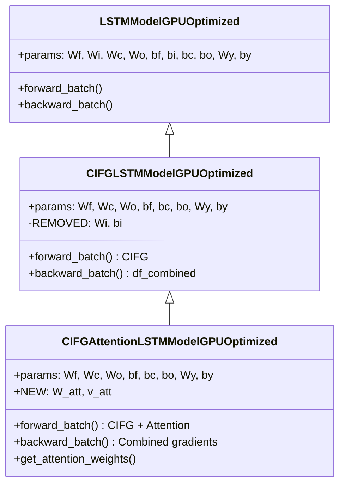

# CIFGAttentionLSTMModelGPUOptimized

Manual untuk kombinasi CIFG (Coupled Input and Forget Gate) + Global Attention LSTM dengan GPU optimization.

---

## Overview

Model ini menggabungkan dua modifikasi LSTM yang powerful:

1. **CIFG**: $i_t = 1 - f_t$ → Mengurangi parameter ~25%
2. **Attention**: $c = \sum \alpha_t \cdot h_t$ → Menangkap long-range dependencies

Kombinasi ini memberikan:
- **Efisiensi memori** dari CIFG (lebih sedikit parameter)
- **Long-range dependency** dari Attention (fokus pada timestep relevan)

> [!TIP]
> Ideal untuk sequence panjang (win=60+) seperti sensor data dalam predictive maintenance, dimana efisiensi dan interpretabilitas sama-sama penting.

---

## Class Hierarchy



---

## Parameter Comparison

| Model | Weight Matrices | Bias Vectors | Change vs Standard |
|-------|-----------------|--------------|-------------------|
| Standard LSTM | Wf, Wi, Wc, Wo, Wy | bf, bi, bc, bo, by | baseline |
| CIFG-only | Wf, Wc, Wo, Wy | bf, bc, bo, by | **-25%** |
| Attention-only | Wf, Wi, Wc, Wo, Wy, W_att, v_att | bf, bi, bc, bo, by | **+H²+H** |
| **CIFG + Attention** | Wf, Wc, Wo, Wy, W_att, v_att | bf, bc, bo, by | **-25% + H²+H** |

> [!IMPORTANT]
> Dengan H=64: CIFG menghemat ~4,160 params, Attention menambah ~4,160 params.
> Net effect: Hampir sama dengan standard LSTM, tapi dengan attention interpretability!

---

## Combined Mathematical Formulation

### CIFG Gates (per timestep)

```
f_t = σ(Wf·[h_{t-1}, x_t] + bf)
i_t = 1 - f_t                      ← CIFG coupling (no Wi, bi)
c̃_t = tanh(Wc·[h_{t-1}, x_t] + bc)
c_t = f_t ⊙ c_{t-1} + (1 - f_t) ⊙ c̃_t
o_t = σ(Wo·[h_{t-1}, x_t] + bo)
h_t = o_t ⊙ tanh(c_t)
```

### Attention Mechanism (after LSTM)

```
1. Collect: H = [h_1, h_2, ..., h_T]
2. Score:   e_t = v_att^T · tanh(W_att · h_t)
3. Weight:  α_t = softmax(e)_t
4. Context: c = Σ α_t · h_t
5. Output:  ŷ = σ(Wy · c + by)
```

---

## Forward Pass

```python
# ===== CIFG-LSTM Forward =====
all_h = []
for t in range(seq_len):
    f = sigmoid(Wf @ z + bf)
    i = 1 - f                    # CIFG: coupled gates
    c_bar = tanh(Wc @ z + bc)
    o = sigmoid(Wo @ z + bo)
    
    c_new = f * c_prev + i * c_bar
    h_new = o * tanh(c_new)
    all_h.append(h_new)

# ===== Attention Mechanism =====
H = stack(all_h)                 # (seq_len, hidden, batch)
S = tanh(W_att @ H)
e = v_att.T @ S                  # Scores
alpha = softmax(e, axis=0)       # Attention weights
context = sum(alpha * H)         # Weighted sum

# ===== Output =====
y_pred = sigmoid(Wy @ context + by)
```

---

## Backward Pass

Kombinasi gradien CIFG dan Attention:

```python
# ===== 1. Attention Gradients =====
d_context = Wy.T @ dy

# Context -> alpha, H
d_alpha = sum(d_context * H)
d_H_att = alpha * d_context

# Softmax backward
d_e = alpha * (d_alpha - sum(alpha * d_alpha))

# Attention params
d_v_att = sum(S * d_e)
d_S = v_att @ d_e
d_pre_S = d_S * (1 - S^2)
d_W_att = sum(d_pre_S @ H.T)
d_H_Watt = W_att.T @ d_pre_S

# Total gradient to hidden states
d_H_total = d_H_att + d_H_Watt

# ===== 2. CIFG-LSTM BPTT =====
for t in reversed(range(seq_len)):
    dh = dh_next + d_H_total[t]   # Add attention gradient!
    
    # Output gate
    do = dh * tanh(c)
    da_o = do * o * (1 - o)
    
    # Cell state
    dc = dh * o * (1 - tanh(c)^2) + dc_next
    
    # Candidate
    da_c = (dc * i) * (1 - c_bar^2)
    
    # CIFG combined gradient (key modification!)
    df = dc * c_prev
    di = dc * c_bar
    df_combined = df - di         # CIFG: di flows to f with -1
    da_f = df_combined * f * (1 - f)
    
    # Next timestep (no Wi contribution!)
    dz = Wf.T @ da_f + Wc.T @ da_c + Wo.T @ da_o
    dh_next = dz[:hidden_size]
    dc_next = f * dc
```

> [!NOTE]
> Key insight: CIFG coupling `df_combined = df - di` dan attention gradient `d_H_total[t]` digabungkan dengan benar di setiap timestep.

---

## Usage Example

```python
from src.model.lstm_cifg_attention import CIFGAttentionLSTMModelGPUOptimized

# Initialize model
model = CIFGAttentionLSTMModelGPUOptimized(
    input_size=10,
    hidden_size=64,
    output_size=1,
    cw=2.2
)

# Check parameter stats
comparison = model.compare_with_standard_lstm()
print(f"Standard LSTM: {comparison['standard_lstm_params']} params")
print(f"CIFG-only: {comparison['cifg_only_params']} params")
print(f"CIFG+Attention: {comparison['cifg_attention_params']} params")
print(f"Net change: {comparison['net_change_percentage']:.2f}%")

# Train
history = model.train(
    X_train, y_train,
    X_val=X_val, y_val=y_val,
    epochs=100,
    batch_size=64,
    lr=0.001
)

# Predict
predictions = model.predict(X_test)

# Get attention weights for interpretability
alpha = model.get_attention_weights(X_test[:5])
# alpha shape: (5, seq_len) - shows which timesteps model focused on
```

---

## Attention Visualization for Sensor Analysis

```python
import matplotlib.pyplot as plt

# Get attention weights
alpha = model.get_attention_weights(X_test[:1])  # (1, seq_len)

# Plot attention over sensor sequence
fig, axes = plt.subplots(2, 1, figsize=(14, 6))

# Top: Sensor signal
axes[0].plot(X_test[0, :, 0], 'b-', label='Sensor 1')
axes[0].set_ylabel('Sensor Value')
axes[0].legend()

# Bottom: Attention weights
axes[1].bar(range(len(alpha[0])), alpha[0], color='orange')
axes[1].set_xlabel('Timestep')
axes[1].set_ylabel('Attention Weight (α)')
axes[1].set_title('Model Focus: Which timesteps predict maintenance?')

plt.tight_layout()
plt.show()
```

> [!TIP]
> Untuk predictive maintenance, attention weights menunjukkan kapan gejala awal maintenance muncul dalam data sensor.

---

## When to Use CIFG + Attention

**Use when:**
- Sequence panjang (win ≥ 60) dimana memory efficiency penting
- Interpretabilitas dibutuhkan (ingin tahu timestep mana yang krusial)
- Predictive maintenance dengan sensor windows
- Trade-off antara model size dan capability diinginkan

**Trade-offs:**
- Sedikit lebih kompleks dari pure CIFG
- Training time sedikit lebih lama dari pure CIFG
- Memory untuk menyimpan semua hidden states
- Net parameter count hampir sama dengan standard LSTM

---

## Architecture Diagram

```mermaid
flowchart LR
    subgraph CIFG_LSTM["CIFG-LSTM (per timestep)"]
        X[x_t] --> Gates
        H_prev[h_{t-1}] --> Gates
        Gates --> |f_t| Forget
        Gates --> |i_t = 1-f_t| Input
        Gates --> |o_t| Output
        Forget --> Cell[c_t]
        Input --> Cell
        Cell --> H_new[h_t]
        Output --> H_new
    end
    
    subgraph Attention["Global Attention"]
        H1[h_1] --> Scoring
        H2[h_2] --> Scoring
        HT[h_T] --> Scoring
        Scoring --> |e_t| Softmax
        Softmax --> |α_t| WeightedSum
        WeightedSum --> Context[context]
    end
    
    H_new --> |collect all| Attention
    Context --> OutputLayer[ŷ = σ(Wy·c + by)]
```

---

## File Location

```
src/model/lstm_cifg_attention.py
```

## Related Models

- [LSTMModelGPUOptimized](./lstm_cupy_optimized.md) - Base class
- [CIFGLSTMModelGPUOptimized](./lstm_cifg.md) - Parent class (CIFG-only)
- [AttentionLSTMModelGPUOptimized](./lstm_attention.md) - Attention-only variant
- [BiLSTMModelGPUOptimized](./lstm_bidirectional.md) - Bidirectional variant

## References

- Greff et al., "LSTM: A Search Space Odyssey" (2017) - IEEE TNNLS
- Bahdanau et al., "Neural Machine Translation by Jointly Learning to Align and Translate" (2015) - ICLR
