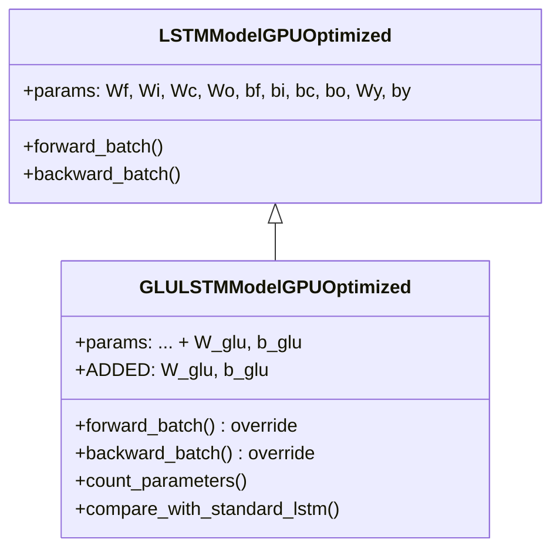

# GLULSTMModelGPUOptimized

Manual untuk variasi Gated Linear Unit (GLU) LSTM dengan GPU optimization.

---

## Overview

GLU LSTM mengganti aktivasi `tanh` pada candidate cell state dengan mekanisme **Gated Linear Unit**:

$$\tilde{c}_t = A \odot \sigma(B)$$

dimana:
- $A = W_c \cdot z + b_c$ (proyeksi linier)
- $B = W_{glu} \cdot z + b_{glu}$ (gate proyeksi)

> [!TIP]
> GLU memberikan jalur gradien linier melalui A, meningkatkan stabilitas pada data noisy.

---

## Class Hierarchy



---

## Parameter Addition

| Model | Candidate Activation | Extra Parameters |
|-------|---------------------|------------------|
| Standard LSTM | `tanh(Wc·z + bc)` | - |
| **GLU LSTM** | `A ⊙ σ(B)` | **W_glu, b_glu** |

> [!IMPORTANT]
> GLU menambah parameter ~20% untuk gate projection tambahan.

---

## Mathematical Formulation

### Standard LSTM Candidate
```
c̃_t = tanh(Wc·[h_{t-1}, x_t] + bc)
```

### GLU LSTM Candidate
```
A = Wc·[h_{t-1}, x_t] + bc         (linear projection)
B = W_glu·[h_{t-1}, x_t] + b_glu   (gate projection)
c̃_t = A ⊙ σ(B)                     (GLU output)
```

---

## Forward Pass

```python
# Standard gates (unchanged)
f = sigmoid(Wf @ z + bf)
i = sigmoid(Wi @ z + bi)
o = sigmoid(Wo @ z + bo)

# GLU candidate state (replaces tanh)
A = Wc @ z + bc           # Linear projection
B = W_glu @ z + b_glu     # Gate projection
gate_B = sigmoid(B)       # GLU gate
c_bar = A * gate_B        # GLU output

# Cell state update
c_new = f * c_prev + i * c_bar
h_new = o * tanh(c_new)
```

---

## Backward Pass

GLU gradient derivation:

```python
# c̃ = A ⊙ σ(B)
# ∂c̃/∂A = σ(B)
# ∂c̃/∂B = A ⊙ σ(B) ⊙ (1 - σ(B))

dc_bar = dc * i

# Gradient for A (linear projection)
dA = dc_bar * gate_B              # ∂c̃/∂A = σ(B)
grads['Wc'] += dA @ z.T
grads['bc'] += sum(dA)

# Gradient for B (GLU gate)
dB = dc_bar * A * gate_B * (1 - gate_B)  # ∂c̃/∂B
grads['W_glu'] += dB @ z.T
grads['b_glu'] += sum(dB)
```

> [!NOTE]
> `dz` sekarang memiliki kontribusi tambahan dari `W_glu.T @ dB`.

---

## Usage Example

```python
from src.model.lstm_glu import GLULSTMModelGPUOptimized

# Initialize model
model = GLULSTMModelGPUOptimized(
    input_size=10,
    hidden_size=64,
    output_size=1,
    cw=2.2
)

# Check parameter increase
comparison = model.compare_with_standard_lstm()
print(f"Standard: {comparison['standard_lstm_params']} params")
print(f"GLU: {comparison['glu_lstm_params']} params")
print(f"Increase: {comparison['increase_percentage']:.2f}%")

# Train (inherits from parent)
history = model.train(
    X_train, y_train,
    X_val=X_val, y_val=y_val,
    epochs=100,
    batch_size=64,
    lr=0.001
)

# Predict
predictions = model.predict(X_test)
```

---

## When to Use GLU LSTM

**Use when:**
- Data memiliki high noise level
- Gradient vanishing menjadi masalah
- Stabilitas training lebih penting dari parameter efficiency

**Trade-offs:**
- ~20% lebih banyak parameter
- Slightly slower forward/backward pass
- Lebih robust terhadap noisy gradients

---

## GLU vs tanh Comparison

| Aspect | tanh | GLU |
|--------|------|-----|
| Gradient flow | Can saturate | Linear path through A |
| Learnable | No | Gate B is learned |
| Parameters | Fewer | More |
| Noise robustness | Lower | Higher |

---

## File Location

```
src/model/lstm_glu.py
```

## Related Models

- [LSTMModelGPUOptimized](./lstm_cupy_optimized.md) - Parent class (Standard LSTM)
- [CIFGLSTMModelGPUOptimized](./lstm_cifg.md) - Coupled gates variant
- [BiLSTMModelGPUOptimized](./lstm_bidirectional.md) - Bidirectional LSTM

## Reference

Dauphin et al., "Language Modeling with Gated Convolutional Networks" (2017) - ICML
