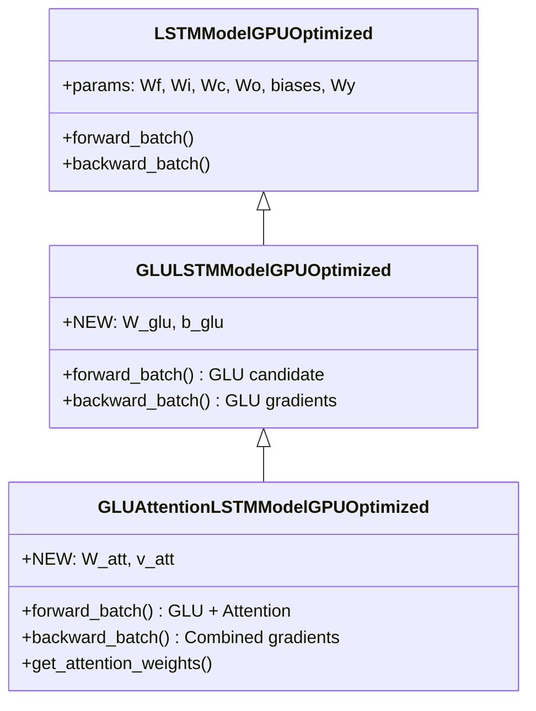
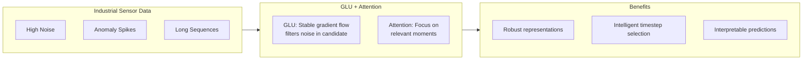
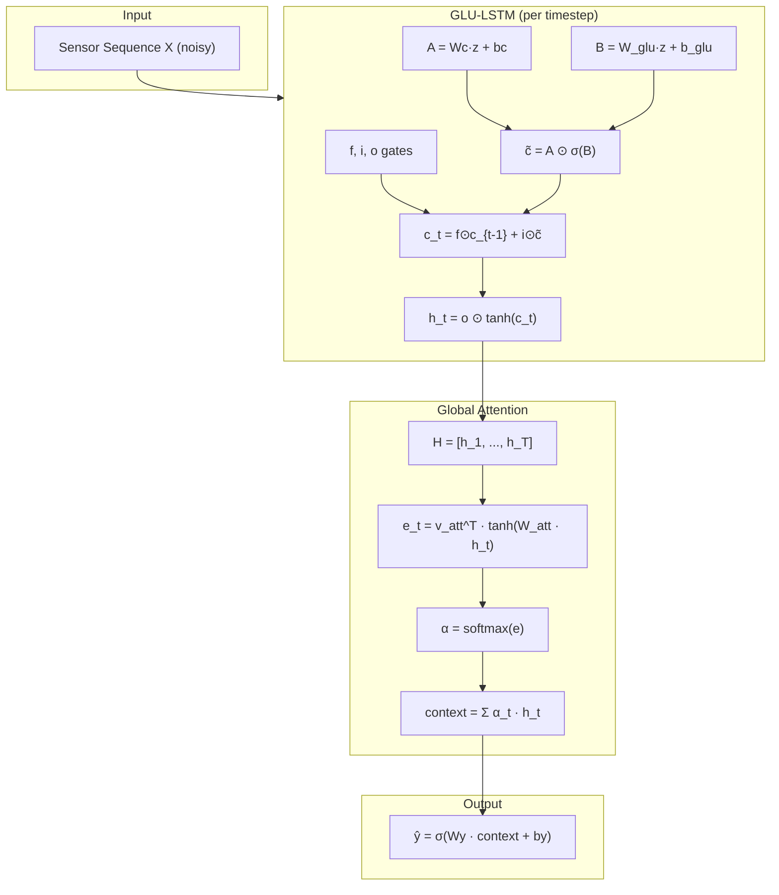

# GLUAttentionLSTMModelGPUOptimized

Manual untuk kombinasi GLU (Gated Linear Unit) + Global Attention LSTM dengan GPU optimization.

---

## Overview

Model ini menggabungkan dua mekanisme yang saling melengkapi:

1. **GLU**: $\tilde{c}_t = A \odot \sigma(B)$ → Stabilitas pada data noisy
2. **Attention**: $c = \sum \alpha_t \cdot h_t$ → Seleksi momen relevan

> [!TIP]
> Kombinasi ini sangat kuat untuk data sensor industri yang ber-noise tinggi. GLU menstabilkan aliran informasi internal, sementara Attention menyeleksi timestep mana yang paling informatif.

---

## Class Hierarchy



---

## Parameter Comparison

| Model | Weight Matrices | Bias Vectors | Additional |
|-------|-----------------|--------------|------------|
| Standard LSTM | Wf, Wi, Wc, Wo, Wy | bf, bi, bc, bo, by | - |
| GLU-only | Wf, Wi, Wc, Wo, W_glu, Wy | + b_glu | +$H(H+I)$ |
| **GLU + Attention** | + W_att, v_att | - | +$H^2 + H$ |

Total overhead vs Standard: $H(H+I) + H^2 + H$

> [!IMPORTANT]
> Dengan H=64, I=10, overhead ≈ 9,000 parameters. Trade-off: more robust on noisy data + interpretability.

---

## Why GLU + Attention?



---

## Mathematical Formulation

### GLU Candidate State (replaces tanh)

```
Standard LSTM: c̃_t = tanh(Wc·z + bc)

GLU LSTM: 
    A = Wc·z + bc           ← Linear projection (information)
    B = W_glu·z + b_glu     ← Gate projection (control)
    c̃_t = A ⊙ σ(B)         ← Gated output
```

**Why GLU is more robust:**
- Linear path through A provides direct gradient flow
- Learnable gate σ(B) controls which information passes
- No saturation like tanh (gradients don't vanish at extremes)

### Attention Mechanism

```
1. Collect: H = [h_1, h_2, ..., h_T]
2. Score:   e_t = v_att^T · tanh(W_att · h_t)
3. Weight:  α_t = softmax(e)_t
4. Context: c = Σ α_t · h_t
5. Output:  ŷ = σ(Wy · c + by)
```

---

## Forward Pass

```python
# ===== GLU-LSTM Forward =====
all_h = []
for t in range(seq_len):
    # Standard gates
    f = sigmoid(Wf @ z + bf)
    i = sigmoid(Wi @ z + bi)
    o = sigmoid(Wo @ z + bo)
    
    # GLU Candidate (replaces tanh)
    A = Wc @ z + bc           # Linear projection
    B = W_glu @ z + b_glu     # Gate projection
    gate_B = sigmoid(B)
    c_bar = A * gate_B        # GLU output
    
    # Cell and hidden state
    c_new = f * c_prev + i * c_bar
    h_new = o * tanh(c_new)
    all_h.append(h_new)

# ===== Attention =====
H = stack(all_h)
S = tanh(W_att @ H)
e = v_att.T @ S
alpha = softmax(e)
context = sum(alpha * H)

# ===== Output =====
y_pred = sigmoid(Wy @ context + by)
```

---

## Backward Pass

Kombinasi gradien GLU dan Attention yang akurat:

```python
# ===== 1. Attention Gradients =====
d_context = Wy.T @ dy

# Context -> alpha, H
d_alpha = sum(d_context * H)
d_H_att = alpha * d_context

# Softmax backward
d_e = alpha * (d_alpha - sum(alpha * d_alpha))

# Attention params
d_v_att = sum(S * d_e)
d_S = v_att @ d_e
d_pre_S = d_S * (1 - S^2)
d_W_att = sum(d_pre_S @ H.T)
d_H_Watt = W_att.T @ d_pre_S

d_H_total = d_H_att + d_H_Watt

# ===== 2. GLU-LSTM BPTT =====
for t in reversed(range(seq_len)):
    dh = dh_next + d_H_total[t]   # Add attention gradient!
    
    # Output gate
    do = dh * tanh(c)
    da_o = do * o * (1 - o)
    
    # Cell state
    dc = dh * o * (1 - tanh(c)^2) + dc_next
    
    # ===== GLU Gradient (Key!) =====
    dc_bar = dc * i
    
    # Gradient for A (linear projection)
    # c̃ = A ⊙ σ(B), so dc̃/dA = σ(B)
    dA = dc_bar * gate_B
    grads['Wc'] += dA @ z.T
    grads['bc'] += sum(dA)
    
    # Gradient for B (GLU gate)
    # dc̃/dB = A ⊙ σ(B) ⊙ (1 - σ(B))
    dB = dc_bar * A * gate_B * (1 - gate_B)
    grads['W_glu'] += dB @ z.T
    grads['b_glu'] += sum(dB)
    
    # Standard gates
    di = dc * c_bar
    da_i = di * i * (1 - i)
    df = dc * c_prev
    da_f = df * f * (1 - f)
    
    # Next timestep (includes GLU contributions!)
    dz = Wf.T @ da_f + Wi.T @ da_i + Wc.T @ dA + W_glu.T @ dB + Wo.T @ da_o
    dh_next = dz[:H]
    dc_next = f * dc
```

> [!NOTE]
> Key GLU gradient derivation:
> - $\frac{\partial \tilde{c}}{\partial A} = \sigma(B)$ (gate value)
> - $\frac{\partial \tilde{c}}{\partial B} = A \cdot \sigma(B) \cdot (1 - \sigma(B))$ (sigmoid derivative scaled by A)

---

## Usage Example

```python
from src.model.lstm_glu_attention import GLUAttentionLSTMModelGPUOptimized

# Initialize model
model = GLUAttentionLSTMModelGPUOptimized(
    input_size=10,
    hidden_size=64,
    output_size=1,
    cw=2.2
)

# Check parameter comparison
comparison = model.compare_with_variants()
print(f"Standard LSTM: {comparison['standard_lstm_params']} params")
print(f"GLU-only: {comparison['glu_only_params']} params")
print(f"GLU+Attention: {comparison['glu_attention_params']} params")
print(f"Total overhead: {comparison['total_overhead_vs_standard']} params")

# Train
history = model.train(
    X_train, y_train,
    X_val=X_val, y_val=y_val,
    epochs=100,
    batch_size=64,
    lr=0.001
)

# Predict
predictions = model.predict(X_test)

# Get attention weights
alpha = model.get_attention_weights(X_test[:5])
# alpha shape: (5, seq_len)
```

---

## Attention on Noisy Sensor Data

```python
import matplotlib.pyplot as plt
import numpy as np

# Sample with noise spike
sample_idx = 0
alpha = model.get_attention_weights(X_test[sample_idx:sample_idx+1])[0]
sensor_data = X_test[sample_idx, :, 0]  # First sensor channel

fig, axes = plt.subplots(2, 1, figsize=(14, 6), sharex=True)

# Noisy sensor signal
axes[0].plot(sensor_data, 'b-', alpha=0.7)
axes[0].set_ylabel('Sensor Value')
axes[0].set_title('Raw Sensor Data (with noise)')

# Attention weights
axes[1].bar(range(len(alpha)), alpha, color='orange', alpha=0.8)
axes[1].set_xlabel('Timestep')
axes[1].set_ylabel('Attention α')
axes[1].set_title('GLU+Attention Focus: Which moments predict maintenance?')

# Highlight high-attention regions
threshold = np.percentile(alpha, 90)
high_att_idx = np.where(alpha > threshold)[0]
for idx in high_att_idx:
    axes[0].axvline(x=idx, color='red', alpha=0.3, linestyle='--')

plt.tight_layout()
plt.show()
```

> [!TIP]
> GLU menstabilkan representasi meskipun data noisy. Attention kemudian bisa fokus pada momen sebenarnya yang relevan, bukan noise spikes.

---

## When to Use GLU + Attention

**Use when:**
- Data sensor dengan noise level tinggi
- Sequence panjang dengan anomali tersebar
- Perlu robustness DAN interpretability
- Gradient stability penting (deep sequences)

**Optimal scenarios:**
- Industrial predictive maintenance
- Vibration sensor analysis
- Temperature monitoring with spikes
- Any noisy time-series classification

**Trade-offs:**
- More parameters than standard LSTM
- Slightly slower training
- Memory for storing hidden states
- Worth it for noisy, long sequences!

---

## Architecture Diagram



---

## File Location

```
src/model/lstm_glu_attention.py
```

## Related Models

- [LSTMModelGPUOptimized](./lstm_cupy_optimized.md) - Base class
- [GLULSTMModelGPUOptimized](./lstm_glu.md) - Parent class (GLU-only)
- [AttentionLSTMModelGPUOptimized](./lstm_attention.md) - Attention-only
- [CIFGAttentionLSTMModelGPUOptimized](./lstm_cifg_attention.md) - Efficient alternative

## References

- Dauphin et al., "Language Modeling with Gated Convolutional Networks" (2017) - ICML
- Bahdanau et al., "Neural Machine Translation by Jointly Learning to Align and Translate" (2015) - ICLR
