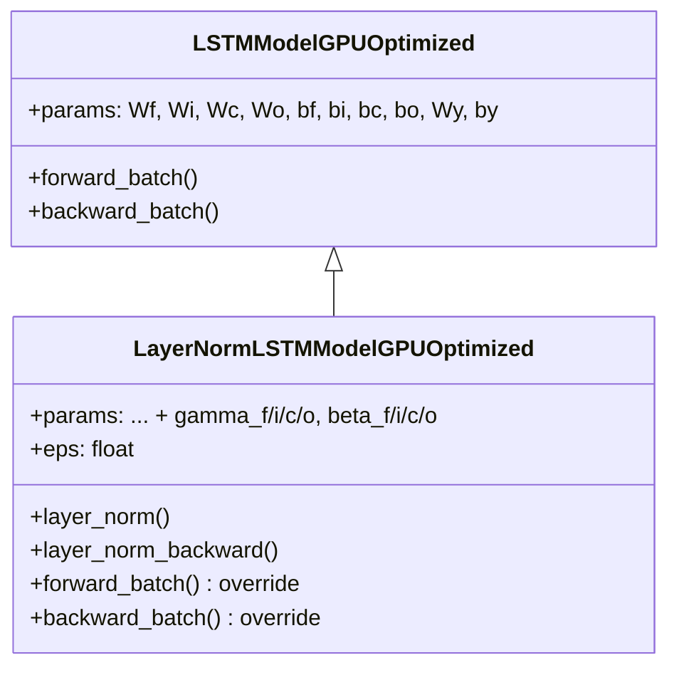

# LayerNormLSTMModelGPUOptimized

Manual untuk variasi Layer Normalization LSTM dengan GPU optimization.

---

## Overview

Layer Normalization LSTM menerapkan normalisasi pada setiap gate sebelum fungsi aktivasi:

$$LN(x) = \gamma \odot \frac{x - \mu}{\sqrt{\sigma^2 + \epsilon}} + \beta$$

Normalisasi dilakukan pada dimensi hidden unit (axis 0).

> [!TIP]
> LayerNorm mempercepat konvergensi dan meningkatkan stabilitas terhadap input ekstrem.

---

## Class Hierarchy



---

## Parameter Addition

| Gate | New Parameters | Shape |
|------|----------------|-------|
| Forget (f) | `gamma_f`, `beta_f` | (hidden_size, 1) |
| Input (i) | `gamma_i`, `beta_i` | (hidden_size, 1) |
| Candidate (c) | `gamma_c`, `beta_c` | (hidden_size, 1) |
| Output (o) | `gamma_o`, `beta_o` | (hidden_size, 1) |

> [!IMPORTANT]
> Total 8 parameter vectors tambahan (4 gamma + 4 beta).

---

## Layer Normalization

### Forward Pass

```python
def layer_norm(x, gamma, beta, eps=1e-5):
    # x: (hidden_size, batch_size)
    
    # Statistics along hidden dimension
    mu = mean(x, axis=0)        # (1, batch_size)
    var = mean((x - mu)², axis=0)
    std = sqrt(var + eps)
    
    # Normalize
    x_hat = (x - mu) / std
    
    # Scale and shift
    return gamma * x_hat + beta
```

### Backward Pass

```python
def layer_norm_backward(dx_norm, cache):
    x, x_centered, std, x_hat, gamma = cache
    H = hidden_size
    
    # Gradients for learnable parameters
    dgamma = sum(dx_norm * x_hat, axis=1)
    dbeta = sum(dx_norm, axis=1)
    
    # Gradient w.r.t x_hat
    dx_hat = dx_norm * gamma
    
    # Gradient w.r.t variance
    dvar = sum(dx_hat * x_centered * (-0.5) * std⁻³)
    
    # Gradient w.r.t mean
    dmu = sum(dx_hat * (-1/std)) + dvar * mean(-2 * x_centered)
    
    # Gradient w.r.t input
    dx = dx_hat/std + dvar*(2*x_centered/H) + dmu/H
    
    return dx, dgamma, dbeta
```

---

## Forward Pass Flow

```
Standard LSTM:
Wf·z + bf → σ → f

LayerNorm LSTM:
Wf·z + bf → LN(γ_f, β_f) → σ → f
```

```python
# Pre-activation
pre_f = Wf @ z + bf
pre_i = Wi @ z + bi
pre_c = Wc @ z + bc
pre_o = Wo @ z + bo

# Layer Normalization
ln_f, cache_f = layer_norm(pre_f, gamma_f, beta_f)
ln_i, cache_i = layer_norm(pre_i, gamma_i, beta_i)
ln_c, cache_c = layer_norm(pre_c, gamma_c, beta_c)
ln_o, cache_o = layer_norm(pre_o, gamma_o, beta_o)

# Activation
f = sigmoid(ln_f)
i = sigmoid(ln_i)
c_bar = tanh(ln_c)
o = sigmoid(ln_o)
```

---

## Backward Pass Flow

```python
# Output gate example
do = dh * tanh(c)
da_o = do * o * (1 - o)     # Gradient after sigmoid

# LayerNorm backward
dln_o, dgamma_o, dbeta_o = layer_norm_backward(da_o, cache_o)

# Update gradients
grads['gamma_o'] += dgamma_o
grads['beta_o'] += dbeta_o
grads['Wo'] += dln_o @ z.T   # Note: dln_o, not da_o
grads['bo'] += sum(dln_o)
```

> [!NOTE]
> Gradient untuk `Wo`, `bo` menggunakan `dln_o` (setelah LN backward), bukan `da_o`.

---

## Usage Example

```python
from src.model.lstm_layernorm import LayerNormLSTMModelGPUOptimized

# Initialize model
model = LayerNormLSTMModelGPUOptimized(
    input_size=10,
    hidden_size=64,
    output_size=1,
    cw=2.2,
    eps=1e-5  # LayerNorm epsilon
)

# Check parameter count
comparison = model.compare_with_standard_lstm()
print(f"Standard: {comparison['standard_lstm_params']} params")
print(f"LayerNorm: {comparison['layernorm_lstm_params']} params")
print(f"Increase: {comparison['increase_percentage']:.2f}%")

# Train (inherits from parent)
history = model.train(
    X_train, y_train,
    X_val=X_val, y_val=y_val,
    epochs=100,
    batch_size=64,
    lr=0.001
)

# Predict
predictions = model.predict(X_test)
```

---

## When to Use LayerNorm LSTM

**Use when:**
- Training tidak stabil dengan standard LSTM
- Data memiliki fluktuasi input ekstrem
- Ingin konvergensi lebih cepat
- Batch size kecil (LayerNorm tidak bergantung pada batch statistics)

**Trade-offs:**
- Overhead komputasi per timestep
- Lebih banyak parameter (minimal)
- Lebih kompleks untuk di-debug

---

## LayerNorm vs BatchNorm

| Aspect | LayerNorm | BatchNorm |
|--------|-----------|-----------|
| Normalization axis | Hidden units | Batch |
| Batch dependency | No | Yes |
| RNN compatibility | ✅ Excellent | ⚠️ Problematic |
| Small batch | Works well | Unstable |

---

## File Location

```
src/model/lstm_layernorm.py
```

## Related Models

- [LSTMModelGPUOptimized](./lstm_cupy_optimized.md) - Parent class (Standard LSTM)
- [CIFGLSTMModelGPUOptimized](./lstm_cifg.md) - Coupled gates variant
- [GLULSTMModelGPUOptimized](./lstm_glu.md) - GLU activation variant

## Reference

Ba et al., "Layer Normalization" (2016) - arXiv:1607.06450
