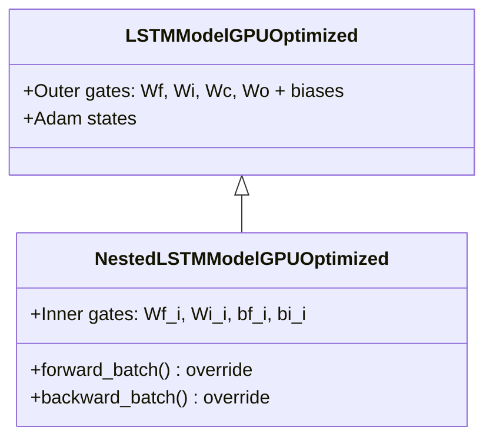

# NestedLSTMModelGPUOptimized

Manual untuk variasi Nested LSTM (Cell-in-Cell) dengan GPU optimization dan Adam optimizer.

---

## Overview

Nested LSTM memodifikasi mekanisme update cell state dengan menambahkan inner gates. Alih-alih update linier standar, cell state diperlakukan sebagai sistem LSTM internal, memungkinkan hierarki memori yang lebih kompleks.

---

## Class Hierarchy



---

## Mathematical Formulation

### Standard LSTM Cell Update
```
c_t = f_t ⊙ c_prev + i_t ⊙ c̃_t
```

### Nested LSTM Cell Update (Hierarchical)
```
# Outer gates (standard)
f_t = σ(W_f z + b_f)
i_t = σ(W_i z + b_i)
c̃_t = tanh(W_c z + b_c)
o_t = σ(W_o z + b_o)

# Inner gates (nested)
f_inner = σ(W_fi z + b_fi)
i_inner = σ(W_ii z + b_ii)

# Hierarchical update
c_temp = f_t ⊙ c_prev + i_t ⊙ c̃_t    ← Standard update (temporary)
c_t = f_inner ⊙ c_prev + i_inner ⊙ tanh(c_temp)  ← Nested update

h_t = o_t ⊙ tanh(c_t)
```

> [!IMPORTANT]
> `c_prev` muncul di dua tempat: outer forget gate dan inner forget gate. Ini membuat backpropagation lebih kompleks.

---

## Parameters

### Outer Gates (inherited from parent)
| Parameter | Shape | Description |
|-----------|-------|-------------|
| `Wf, Wi, Wc, Wo` | (hidden_size, z_dim) | Outer gate weights |
| `bf, bi, bc, bo` | (hidden_size, 1) | Outer gate biases |

### Inner Gates (new)
| Parameter | Shape | Description |
|-----------|-------|-------------|
| `Wf_i` | (hidden_size, z_dim) | Inner forget gate weight |
| `bf_i` | (hidden_size, 1) | Inner forget gate bias |
| `Wi_i` | (hidden_size, z_dim) | Inner input gate weight |
| `bi_i` | (hidden_size, 1) | Inner input gate bias |

---

## Gradient Derivation

### Key Insight: Multiple Paths to c_prev

```
dc_prev = dc_temp * f     +    dc * f_inner
          ↑                      ↑
      (outer path)          (inner path)
```

### Inner Gates Gradients

```python
# i_inner gradient
tanh_c_temp = cp.tanh(c_temp)
di_inner = dc * tanh_c_temp
da_i_inner = di_inner * i_inner * (1 - i_inner)

# f_inner gradient
df_inner = dc * c_prev
da_f_inner = df_inner * f_inner * (1 - f_inner)

# c_temp gradient (for outer gates)
dc_temp = dc * i_inner * (1 - tanh_c_temp**2)
```

---

## Usage Example

```python
from src.model import NestedLSTMModelGPUOptimized

model = NestedLSTMModelGPUOptimized(
    input_size=10,
    hidden_size=64,
    output_size=1,
    cw=2.2
)

history = model.train(
    X_train, y_train,
    X_val=X_val, y_val=y_val,
    epochs=100,
    batch_size=64,
    lr=0.001
)
```

---

## When to Use Nested LSTM

**Use when:**
- Task membutuhkan hierarki memori yang kompleks
- Standard LSTM tidak cukup capture multi-scale temporal patterns
- Data memiliki nested temporal structures

**Trade-offs:**
- +4 parameter matrices (moderate overhead)
- Lebih kompleks untuk debug
- May help with very long sequences

---

## File Location

```
src/model/lstm_nested.py
```

## Related Models

- [LSTMModelGPUOptimized](./lstm_cupy_optimized.md) - Parent class
- [PeepholeLSTMModelGPUOptimized](./lstm_peephole.md) - LSTM with peephole
- [BiLSTMModelGPUOptimized](./lstm_bidirectional.md) - Bidirectional LSTM
