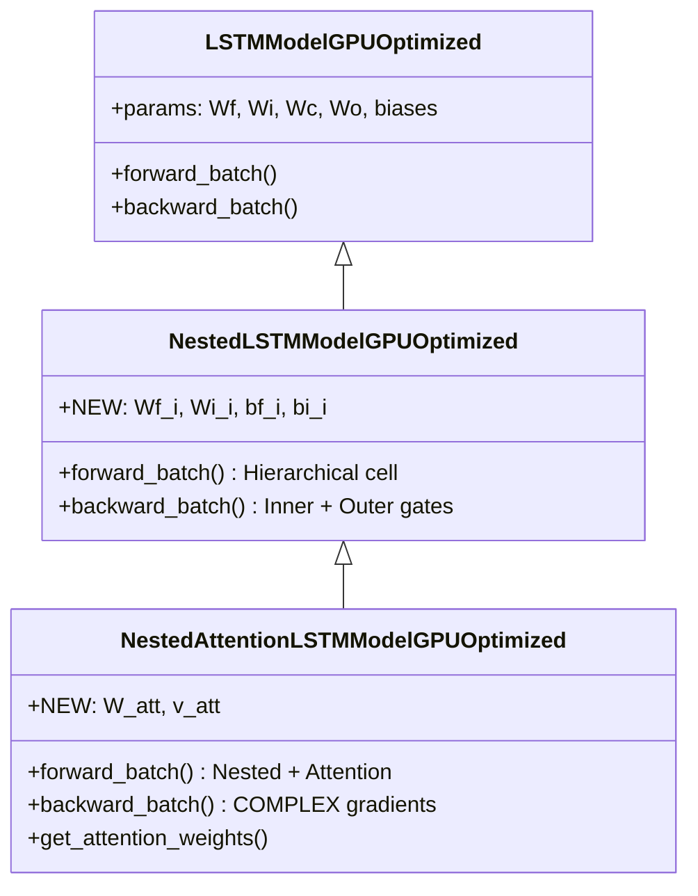
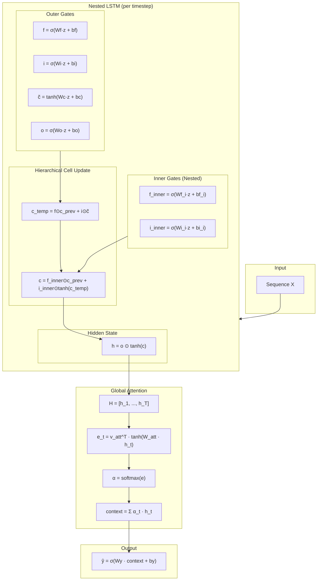
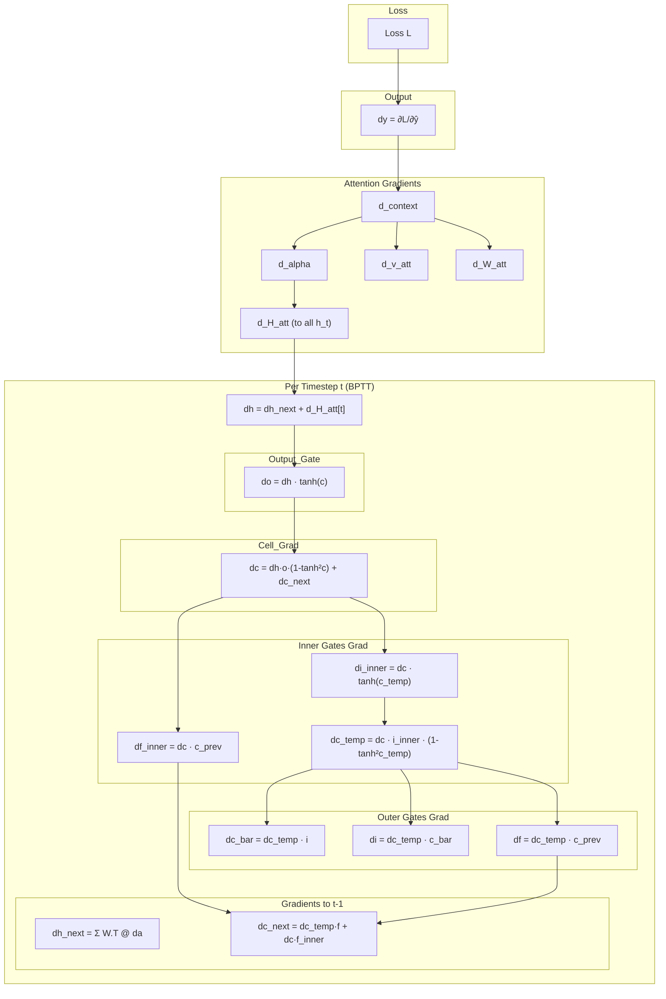

# NestedAttentionLSTMModelGPUOptimized

Manual untuk kombinasi Nested LSTM + Global Attention - model paling kompleks dengan hierarki memori dan seleksi global.

---

## Overview

Model ini adalah yang **paling kompleks**, menggabungkan:

1. **Nested LSTM**: Hierarki cell state dengan inner gates ($f_{inner}$, $i_{inner}$)
2. **Attention**: Seleksi global pada outer hidden states

> [!IMPORTANT]
> Model ini memiliki **jalur gradien terpanjang** dan paling banyak parameter. Hanya gunakan jika temporal patterns sangat kompleks dengan multi-scale dependencies.

---

## Class Hierarchy



---

## Parameter Comparison

| Model | Gates | Additional | Total Overhead |
|-------|-------|------------|----------------|
| Standard LSTM | 4 outer | - | baseline |
| Nested-only | 4 outer + 2 inner | $2H(H+I) + 2H$ | +~50% |
| **Nested + Attention** | 4 outer + 2 inner + att | $+H^2 + H$ | **+~75%** |

> [!WARNING]
> Dengan H=64, I=10, Nested+Attention memiliki ~35,000 parameters vs ~20,000 untuk standard LSTM.

---

## Architecture Diagram



---

## Mathematical Formulation

### Nested LSTM (per timestep)

```
Outer Gates (Standard):
    f_t = σ(Wf·[h_{t-1}, x_t] + bf)
    i_t = σ(Wi·[h_{t-1}, x_t] + bi)
    c̃_t = tanh(Wc·[h_{t-1}, x_t] + bc)
    o_t = σ(Wo·[h_{t-1}, x_t] + bo)

Inner Gates (Nested):
    f_inner = σ(Wf_i·[h_{t-1}, x_t] + bf_i)
    i_inner = σ(Wi_i·[h_{t-1}, x_t] + bi_i)

Hierarchical Cell Update:
    c_temp = f_t ⊙ c_{t-1} + i_t ⊙ c̃_t       ← Standard cell (intermediate)
    c_t = f_inner ⊙ c_{t-1} + i_inner ⊙ tanh(c_temp)  ← Nested update

Hidden State:
    h_t = o_t ⊙ tanh(c_t)
```

### Attention Mechanism

```
1. Collect: H = [h_1, h_2, ..., h_T]
2. Score:   e_t = v_att^T · tanh(W_att · h_t)
3. Weight:  α_t = softmax(e)_t
4. Context: c = Σ α_t · h_t
5. Output:  ŷ = σ(Wy · c + by)
```

---

## Forward Pass

```python
# ===== Nested LSTM Forward =====
all_h = []
for t in range(seq_len):
    # Outer gates
    f = sigmoid(Wf @ z + bf)
    i = sigmoid(Wi @ z + bi)
    c_bar = tanh(Wc @ z + bc)
    o = sigmoid(Wo @ z + bo)
    
    # Inner gates (Nested)
    f_inner = sigmoid(Wf_i @ z + bf_i)
    i_inner = sigmoid(Wi_i @ z + bi_i)
    
    # Hierarchical cell update
    c_temp = f * c_prev + i * c_bar        # Step 1: Standard
    c_new = f_inner * c_prev + i_inner * tanh(c_temp)  # Step 2: Nested
    
    # Hidden state
    h_new = o * tanh(c_new)
    all_h.append(h_new)

# ===== Attention =====
H = stack(all_h)
S = tanh(W_att @ H)
e = v_att.T @ S
alpha = softmax(e)
context = sum(alpha * H)

# ===== Output =====
y_pred = sigmoid(Wy @ context + by)
```

---

## Backward Pass: The Most Complex Gradient Path



---

## Backward Pass Code (Key Parts)

```python
# ===== 1. Attention Gradients =====
d_context = Wy.T @ dy
d_alpha = sum(d_context * H)
d_H_att = alpha * d_context
# ... softmax, W_att, v_att gradients ...

d_H_total = d_H_att + d_H_Watt

# ===== 2. Nested LSTM BPTT =====
for t in reversed(range(seq_len)):
    # dh receives gradient from attention!
    dh = dh_next + d_H_total[t]
    
    # Output gate
    do = dh * tanh(c)
    dc = dh * o * (1 - tanh(c)^2) + dc_next
    
    # ===== Inner Gates =====
    tanh_c_temp = tanh(c_temp)
    
    # i_inner gradient
    di_inner = dc * tanh_c_temp
    da_i_inner = di_inner * i_inner * (1 - i_inner)
    
    # f_inner gradient
    df_inner = dc * c_prev
    da_f_inner = df_inner * f_inner * (1 - f_inner)
    
    # Gradient through tanh to c_temp
    dc_temp = dc * i_inner * (1 - tanh_c_temp^2)
    
    # ===== Outer Gates (through c_temp) =====
    dc_bar = dc_temp * i
    da_c = dc_bar * (1 - c_bar^2)
    
    di = dc_temp * c_bar
    da_i = di * i * (1 - i)
    
    df = dc_temp * c_prev
    da_f = df * f * (1 - f)
    
    # ===== CRITICAL: dc_prev has TWO PATHS =====
    # Path 1: From outer forget gate in c_temp
    # Path 2: From inner forget gate
    dc_next = dc_temp * f + dc * f_inner
    
    # dz receives from ALL 6 gates
    dz = (Wf.T @ da_f + Wi.T @ da_i + Wc.T @ da_c + 
          Wo.T @ da_o + Wf_i.T @ da_f_inner + Wi_i.T @ da_i_inner)
    dh_next = dz[:H]
```

> [!CAUTION]
> Key insight: `dc_next` memiliki DUA jalur yang harus dijumlahkan:
> 1. `dc_temp * f` - dari outer forget gate
> 2. `dc * f_inner` - dari inner forget gate
> Jika salah satu terlewat, gradien akan salah!

---

## Usage Example

```python
from src.model.lstm_nested_attention import NestedAttentionLSTMModelGPUOptimized

# Initialize model (most parameters)
model = NestedAttentionLSTMModelGPUOptimized(
    input_size=10,
    hidden_size=64,
    output_size=1,
    cw=2.2
)

# Check parameter comparison
comparison = model.compare_with_variants()
print(f"Standard LSTM: {comparison['standard_lstm_params']} params")
print(f"Nested-only: {comparison['nested_only_params']} params")
print(f"Nested+Attention: {comparison['nested_attention_params']} params")
print(f"Total overhead: {comparison['total_overhead_vs_standard']} params")

# Train (slower due to complexity)
history = model.train(
    X_train, y_train,
    X_val=X_val, y_val=y_val,
    epochs=100,
    batch_size=64,
    lr=0.001
)

# Predict
predictions = model.predict(X_test)

# Get attention weights
alpha = model.get_attention_weights(X_test[:5])
```

---

## When to Use Nested + Attention

**Use when:**
- Temporal patterns dengan **multi-scale dependencies**
- Membutuhkan **hierarchical memory** (coarse + fine-grained)
- Data memiliki kompleksitas tinggi yang tidak bisa ditangkap model sederhana
- Computational resources memadai

**NOT recommended for:**
- Simple sequences
- Real-time applications (slowest model)
- Limited GPU memory
- When simpler models achieve similar performance

---

## Computational Complexity Comparison

| Model | Parameters | Forward Time | Backward Time |
|-------|------------|--------------|---------------|
| Standard LSTM | $4H(H+I)$ | 1× | 1× |
| Nested | $6H(H+I)$ | ~1.3× | ~1.5× |
| Attention | $4H(H+I) + H^2$ | ~1.2× | ~1.4× |
| **Nested + Attention** | $6H(H+I) + H^2$ | ~1.5× | **~2×** |

---

## Gradient Path Lengths

| Model | Max Gradient Path |
|-------|-------------------|
| Standard LSTM | h → c → Wf,Wi,Wc,Wo |
| Nested | h → c → c_temp → inner gates, outer gates |
| Attention | h → context → alpha → H → LSTM path |
| **Nested + Attention** | h → context → alpha → H → c → c_temp → 6 gates |

> [!NOTE]
> Panjang gradient path mempengaruhi:
> 1. **Vanishing/exploding gradients** - perlu gradient clipping
> 2. **Training time** - lebih banyak operasi per backward
> 3. **Numerical stability** - perlu careful initialization

---

## File Location

```
src/model/lstm_nested_attention.py
```

## Related Models

- [LSTMModelGPUOptimized](./lstm_cupy_optimized.md) - Base class
- [NestedLSTMModelGPUOptimized](./lstm_nested.md) - Parent class (Nested-only)
- [AttentionLSTMModelGPUOptimized](./lstm_attention.md) - Attention-only
- [CIFGAttentionLSTMModelGPUOptimized](./lstm_cifg_attention.md) - Simpler efficient alternative

## References

- Moniz & Krueger, "Nested LSTMs" (2017) - NeurIPS Workshop
- Bahdanau et al., "Neural Machine Translation by Jointly Learning to Align and Translate" (2015) - ICLR
