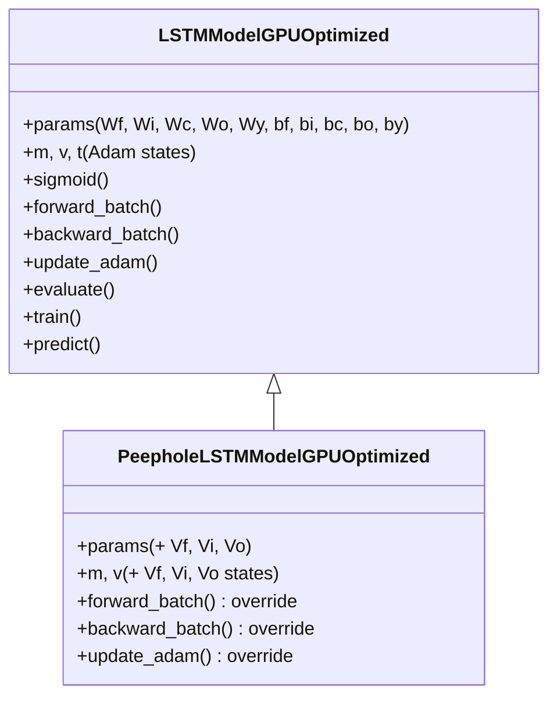

# PeepholeLSTMModelGPUOptimized

Manual untuk variasi Peephole LSTM dengan GPU optimization dan Adam optimizer.

---

## Overview

Peephole LSTM menambahkan koneksi langsung dari cell state ke gates, memungkinkan gates untuk "mengintip" nilai cell state saat membuat keputusan. Ini meningkatkan kapasitas memori model untuk long-term dependencies.

---

## Class Hierarchy



---

## Mathematical Formulation

### Standard LSTM
```
f_t = σ(W_f z + b_f)
i_t = σ(W_i z + b_i)
c_t = f_t ⊙ c_{prev} + i_t ⊙ tanh(W_c z + b_c)
o_t = σ(W_o z + b_o)
h_t = o_t ⊙ tanh(c_t)
```

### Peephole LSTM
```
f_t = σ(W_f z + V_f ⊙ c_{prev} + b_f)   ← peephole from previous cell
i_t = σ(W_i z + V_i ⊙ c_{prev} + b_i)   ← peephole from previous cell
c_t = f_t ⊙ c_{prev} + i_t ⊙ tanh(W_c z + b_c)
o_t = σ(W_o z + V_o ⊙ c_t + b_o)        ← peephole from CURRENT cell
h_t = o_t ⊙ tanh(c_t)
```

> [!IMPORTANT]
> Gate $f$ dan $i$ melihat $c_{prev}$ (cell sebelumnya), sedangkan gate $o$ melihat $c_t$ (cell saat ini).

---

## Parameters

### Additional Parameters (Peephole)

| Parameter | Shape | Scale | Description |
|-----------|-------|-------|-------------|
| `Vf` | (hidden_size, 1) | 0.01 | Peephole weight for forget gate |
| `Vi` | (hidden_size, 1) | 0.01 | Peephole weight for input gate |
| `Vo` | (hidden_size, 1) | 0.01 | Peephole weight for output gate |

> [!NOTE]
> Scale 0.01 digunakan agar efek peephole tidak langsung mendominasi gate di awal training.

### Broadcasting
- `V` shape: `(hidden_size, 1)`
- `c` shape: `(hidden_size, batch_size)`
- Operasi `V * c` menghasilkan `(hidden_size, batch_size)` via CuPy broadcasting

---

## Gradient Derivation

### Peephole V_o (Output Gate)

Output gate menggunakan cell state **saat ini** ($c_t$):

$$\frac{\partial L}{\partial V_o} = \sum_t da_o \cdot c_t$$

```python
grads['Vo'] += cp.sum(da_o * c, axis=1, keepdims=True) / batch_size
```

### Peephole V_f dan V_i (Forget & Input Gate)

Forget dan input gate menggunakan cell state **sebelumnya** ($c_{prev}$):

$$\frac{\partial L}{\partial V_f} = \sum_t da_f \cdot c_{prev}$$
$$\frac{\partial L}{\partial V_i} = \sum_t da_i \cdot c_{prev}$$

```python
grads['Vf'] += cp.sum(da_f * c_prev, axis=1, keepdims=True) / batch_size
grads['Vi'] += cp.sum(da_i * c_prev, axis=1, keepdims=True) / batch_size
```

### Additional Backprop Terms

Cell state gradient juga harus memperhitungkan jalur melalui peephole:

```python
# Tambahan dc dari output gate peephole
dc += da_o * self.params['Vo']

# dc_next untuk timestep sebelumnya
dc_next = f * dc + da_f * self.params['Vf'] + da_i * self.params['Vi']
```

---

## Usage Example

```python
from src.model import PeepholeLSTMModelGPUOptimized

# Initialize model
model = PeepholeLSTMModelGPUOptimized(
    input_size=10,      # Number of features
    hidden_size=64,     # Hidden units
    output_size=1,      # Binary classification
    cw=2.2              # Class weight for positive class
)

# Train (inherits from parent)
history = model.train(
    X_train, y_train,
    X_val=X_val, y_val=y_val,
    epochs=100,
    batch_size=64,
    lr=0.001,
    patience=7,
    lambda_l2=0.01
)

# Predict (inherits from parent)
predictions = model.predict(X_test)
```

---

## When to Use Peephole LSTM

**Use when:**
- Model perlu belajar precise timing dari events
- Long-term dependencies sangat penting
- Standard LSTM tidak cukup capture temporal patterns

**Trade-offs:**
- +3 parameter vectors (small overhead)
- Slightly more computation per forward/backward pass
- May improve convergence for certain tasks

---

## File Location

```
src/model/lstm_peephole.py
```

## Related Models

- [LSTMModelGPUOptimized](./lstm_cupy_optimized.md) - Parent class (Standard LSTM + Adam)
- [LSTMModelGPUSGD](./lstm_cupy_sgd.md) - Standard LSTM + SGD optimizer
