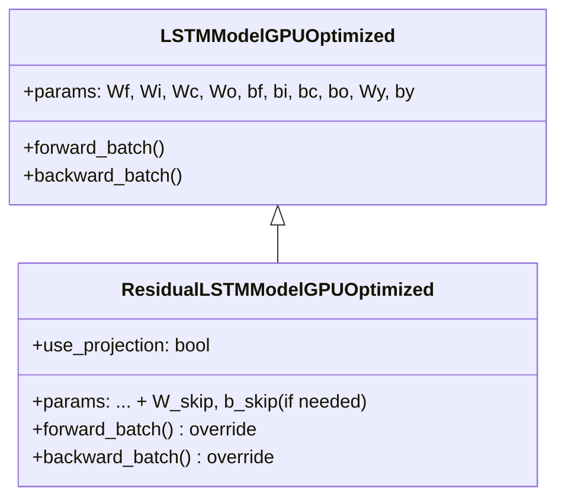

# ResidualLSTMModelGPUOptimized

Manual untuk variasi Residual LSTM dengan skip connections dan GPU optimization.

---

## Overview

Residual LSTM menambahkan jalur skip connection dari input ke output:

$$h_t = h_{lstm} + \text{projection}(x_t)$$

Skip connection mencegah degradasi sinyal pada jendela waktu panjang.

> [!TIP]
> Residual connections memungkinkan gradient mengalir langsung melalui identity path.

---

## Class Hierarchy



---

## Skip Connection Architecture

```
                    ┌──────────────────────────────┐
                    │        Skip Connection       │
                    │   (W_skip if dims differ)    │
         x_t ───────┼──────────────────────────────┼───────┐
                    │                              │       │
                    ▼                              │       ▼
              ┌──────────┐                         │    ┌─────┐
              │   LSTM   │ ──────► h_lstm ─────────┼───►│  +  │───► h_t
              │   Cell   │                         │    └─────┘
              └──────────┘                         │
                    ▲                              │
                    │                              │
              h_{t-1}, c_{t-1}                     │
                                                   │
                    projection(x_t) ◄──────────────┘
```

---

## Projection Matrix

| Condition | Projection | Parameters |
|-----------|-----------|------------|
| `input_size == hidden_size` | Identity | None |
| `input_size != hidden_size` | `W_skip @ x_t + b_skip` | W_skip, b_skip |

> [!IMPORTANT]
> Projection matrix hanya ditambahkan jika dimensi tidak match.

---

## Forward Pass

```python
# Standard LSTM gates
f = sigmoid(Wf @ z + bf)
i = sigmoid(Wi @ z + bi)
c_bar = tanh(Wc @ z + bc)
o = sigmoid(Wo @ z + bo)

# Cell and LSTM hidden state
c_new = f * c_prev + i * c_bar
h_lstm = o * tanh(c_new)

# Skip connection
if use_projection:
    x_skip = W_skip @ x_t + b_skip
else:
    x_skip = x_t

# Residual output
h_new = h_lstm + x_skip  # ← Key modification
```

---

## Backward Pass

Gradient mengalir melalui dua jalur:

```python
dh = dh_next  # Gradient w.r.t h_new

# Split into two paths
dh_lstm = dh   # → LSTM path
dx_skip = dh   # → Skip path

# Skip connection gradients
if use_projection:
    grads['W_skip'] += dx_skip @ x_t.T
    grads['b_skip'] += sum(dx_skip)
    dx_t_skip = W_skip.T @ dx_skip

# LSTM path gradients (standard BPTT)
do = dh_lstm * tanh(c)
# ... (standard LSTM backward)
```

> [!NOTE]
> Gradient dari output mengalir ke KEDUA path secara bersamaan.

---

## Usage Example

```python
from src.model.lstm_residual import ResidualLSTMModelGPUOptimized

# Initialize model (with projection if dims differ)
model = ResidualLSTMModelGPUOptimized(
    input_size=10,    # Different from hidden_size
    hidden_size=64,   # → W_skip will be created
    output_size=1,
    cw=2.2
)

# Check if projection is used
comparison = model.compare_with_standard_lstm()
print(f"Uses projection: {comparison['uses_projection']}")
print(f"Standard: {comparison['standard_lstm_params']} params")
print(f"Residual: {comparison['residual_lstm_params']} params")

# Train (inherits from parent)
history = model.train(
    X_train, y_train,
    X_val=X_val, y_val=y_val,
    epochs=100,
    batch_size=64,
    lr=0.001
)

# Predict
predictions = model.predict(X_test)
```

---

## When to Use Residual LSTM

**Use when:**
- Sequence sangat panjang (> 100 timesteps)
- Signal degradation menjadi masalah
- Training deep LSTM stacks
- Model perlu "remember" input directly

**Trade-offs:**
- Minimal parameter overhead (only if projection needed)
- Slightly more memory (store x_skip in cache)
- Better gradient flow but may make model "lazy"

---

## Residual vs Standard LSTM

| Aspect | Standard | Residual |
|--------|----------|----------|
| Gradient flow | Through gates only | + Identity path |
| Long sequences | Signal degrades | Signal preserved |
| Learning | All through LSTM | Can bypass LSTM |
| Parameters | Baseline | + W_skip if needed |

---

## File Location

```
src/model/lstm_residual.py
```

## Related Models

- [LSTMModelGPUOptimized](./lstm_cupy_optimized.md) - Parent class (Standard LSTM)
- [LayerNormLSTMModelGPUOptimized](./lstm_layernorm.md) - Layer normalization variant
- [CIFGLSTMModelGPUOptimized](./lstm_cifg.md) - Coupled gates variant

## Reference

He et al., "Deep Residual Learning for Image Recognition" (2016) - CVPR
